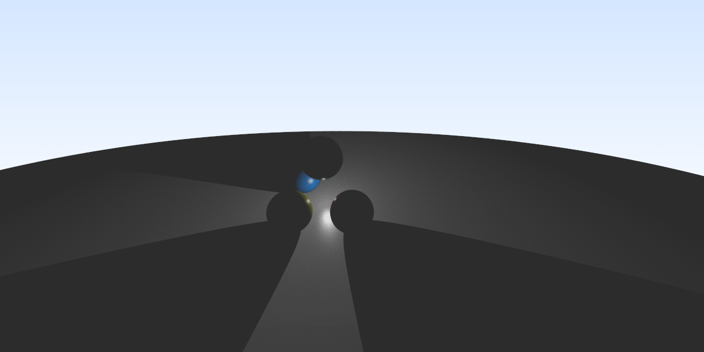
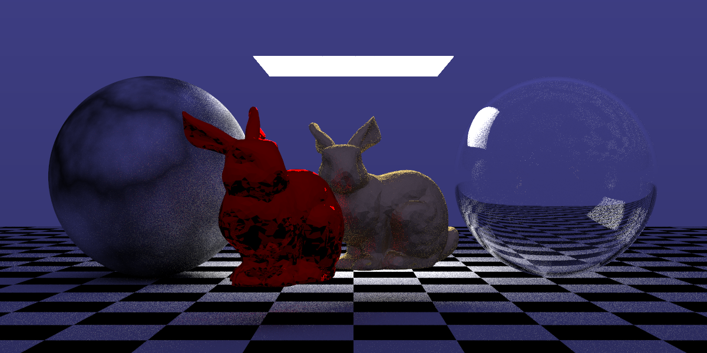

# RAIN

## Description

Rain is an image renderer that uses [_ray casting_](https://en.wikipedia.org/wiki/Ray_casting) and [_ray tracing_](https://en.wikipedia.org/wiki/Ray_tracing_(graphics)) techniques.

### About

This image renderer is a project of Computer Graphics course of the Federal University of Rio Grande do Norte (UFRN).

The name rain is an acronym for **RA**y trac**IN**g.

## Features and TO DOs

- [x] Ray Tracer
  - [x] Anti-aliasing
  - [x] Threads
  - [x] Shaders
    - [x] Background
    - [x] Normal to RGB
    - [x] Depth Map
    - [x] Blinn-Phong
    - [x] Toon (Cel)
    - [x] Lambertian

- [x] Scene
  - [x] Scene reader
  - [x] Scene components
    - [x] Light
      - [x] Directional Light
      - [x] Point Light
      - [x] Spotlight
    - [x] Shapes
      - [x] Sphere
      - [x] Triangle
      - [x] Box
      - [x] Mesh
      - [x] Materials
        - [x] Blinn-Phong
        - [x] Diffuse
        - [x] Metal
        - [x] Toon
        - [x] Dielectrics
        - [x] Texture
          - [x] Simple Texture
          - [x] Perlin Noise Texture
  - [x] Camera
    - [x] Perspective
    - [x] Orthogonal

- [x] Printer
  - [x] ASCII
  - [x] Binary
  - [x] Supported image file formats
    - [x] PPM
- [x] Miscellaneous
  - [x] Progress Bar
  - [x] Show render time

## Dependencies

- C++11
- GLM 0.9.9

## How to compile

Use the ```make``` command to compile the renderer.

## How to use

Choose a scene and run the renderer passing the file path of the scene as an argument to render an image. See [_here_](https://github.com/brenov/rain/tree/master/samples) all the images rendered by rain

```bash
# ./render scenefile.txt
./render hello-rain.txt
```

## Scene file format

### Sky

#### Image


> NOTE: The image was converted to png format to be shown here, the renderer does not generate images in that format.

#### Scene Description File

```txt
# Output settings
NAME: sky.ppm
TYPE: PPM
CODIFICATION: binary # or ascii
WIDTH: 1200
HEIGHT: 600
# Ray Tracer Settings
SAMPLES: 1 # Number of samples for anti-aliasing
RAYS:    0 # Number of rays of the recursion
# Camera
CAMERA:
    PERSPECTIVE
    LOOK_FROM: 0 0 0
    LOOK_AT: 0 0 -1
    VUP: 0 1 0
    VFOV: 90
    ASPECT_RATIO: 2
    APERTURE: 0
    FOCAL_DISTANCE: 1
# Scene description
SHADER:
    BACKGROUND
BACKGROUND:
    TOP: 0.5 0.7 1 # Top color
    BOTTOM: 1 1 1  # Bottom color
```

### Blinn-Phong Shader

#### Image


> NOTE: The image was converted to png format to be shown here, the renderer does not generate images in that format.

#### Scene Description File

```txt
# Output settings
NAME: point_light_1_perspective.ppm
TYPE: PPM
CODIFICATION: binary # or ascii
WIDTH: 1200
HEIGHT: 600
# Ray Tracer Settings
SAMPLES: 100 # Number of samples for anti-aliasing
RAYS:    0   # Number of rays of the recursion
# Camera
CAMERA:
    PERSPECTIVE
    LOOK_FROM: 3 3 2
    LOOK_AT: 0 0 -1
    VUP: 0 1 0
    VFOV: 90
    ASPECT_RATIO: 2
    APERTURE: 0
    FOCAL_DISTANCE: 1
# Scene description
SHADER:
    BLINNPHONG
    AMBIENT_LIGHT: 0.3 0.3 0.3
BACKGROUND:
    TOP: 0.5 0.7 1 # Top color
    BOTTOM: 1 1 1  # Bottom color
COMPONENTS:
    POINT_LIGHT:
        ORIGIN: 0 0 0
        INTENSITY: 1 1 1
    SPHERE:
        ORIGIN: 0 -100.5 0
        RADIUS: 100
        BLINN_PHONG_MATERIAL:
            KA: 0.1 0.1 0.1
            KD: 0.3 0.3 0.3
            KS: 1 1 1
            P: 64
    SPHERE:
        ORIGIN: 1 0 0
        RADIUS: 0.5
        BLINN_PHONG_MATERIAL:
            KA: 0.1 0.1 0.1
            KD: 0.3 0 0
            KS: 0.9 0.9 0.9
            P: 64
    SPHERE:
        ORIGIN: -1 0 0
        RADIUS: 0.5
        BLINN_PHONG_MATERIAL:
            KA: 0.1 0.1 0.1
            KD: 0 0.3 0.8
            KS: 0.9 0.9 0.9
            P: 64
    SPHERE:
        ORIGIN: 0 0 1
        RADIUS: 0.5
        BLINN_PHONG_MATERIAL:
            KA: 0.1 0.1 0.1
            KD: 0.5 0.5 0
            KS: 0.9 0.9 0.9
            P: 64
    SPHERE:
        ORIGIN: 0 1 0
        RADIUS: 0.5
        BLINN_PHONG_MATERIAL:
            KA: 0.1 0.1 0.1
            KD: 0 0.2 0
            KS: 0.9 0.9 0.9
            P: 64
```

### Lambertian Shader

#### Image


> NOTE: The image was converted to png format to be shown here, the renderer does not generate images in that format.

#### Scene Description File

```txt
# Output settings
NAME: bunnies.ppm
TYPE: PPM
CODIFICATION: binary # or ascii
WIDTH: 1200
HEIGHT: 600
# Ray Tracer Settings
SAMPLES: 100 # Number of samples for anti-aliasing
RAYS:    100 # Number of rays of the recursion
# Camera
CAMERA:
    PERSPECTIVE
    LOOK_FROM: 0 0 4
    LOOK_AT: 0 0 -1
    VUP: 0 1 0
    VFOV: 20
    ASPECT_RATIO: 2
    APERTURE: 0
    FOCAL_DISTANCE: 1
# Scene description
SHADER:
    LAMBERTIAN
BACKGROUND:
    TOP: 0.09803921568 0.09803921568 0.43921568627   # Top color
    BOTTOM: 0 0 0 # Bottom color
COMPONENTS:
    PLANE:
        P1: -100 -0.5 100
        P2: 100 -0.5 100
        P3: 100 -0.5 -100
        P4: -100 -0.5 -100
        LAMBERTIAN:
            CHECKER_TEXTURE:
                ODD: 0.3 0.3 0.3
                EVEN: 0 0 0
    PLANE:
        P1: -0.5 0.6 -1
        P2: 0.5 0.6 -1
        P3: 0.5 0.6 -2
        P4: -0.5 0.6 -2
        DIFFUSE_LIGHT:
            EMIT: 10 10 10
    SPHERE:
        ORIGIN: -1 0 -1
        RADIUS: 0.5
        LAMBERTIAN:
            PERLIN_TEXTURE:
                VALUE: 1
    SPHERE:
        ORIGIN: 1 0 -1
        RADIUS: 0.5## License

        This project is licensed under MIT license - see the [MIT](LICENSE) file for details.

        DIELECTRIC:
            RI: 1.2
    SPHERE:
        ORIGIN: 1 0 -1
        RADIUS: -0.48
        DIELECTRIC:
            RI: 1.2
    MESH:
        FILE: samples/mesh/bunny.obj
        METAL:
            ALBEDO: 0.8 0.6 0.2
            FUZZ: 1
        SCALE:
            VALUE: 4 4 4
        TRANSLATE:
            VALUE: 0.2 -0.5 0
        ROTATE:
            VALUE: 0 25 0
    MESH:
        FILE: samples/mesh/bunny.obj
        METAL:
            ALBEDO: 1 0 0
            FUZZ: 0
        SCALE:
            VALUE: 4 4 4
        TRANSLATE:
            VALUE: -0.5 -0.5 0
        ROTATE:
            VALUE: 0 60 0
```

## License

This project is licensed under the MIT License - see the [LICENSE](LICENSE) file for details.
