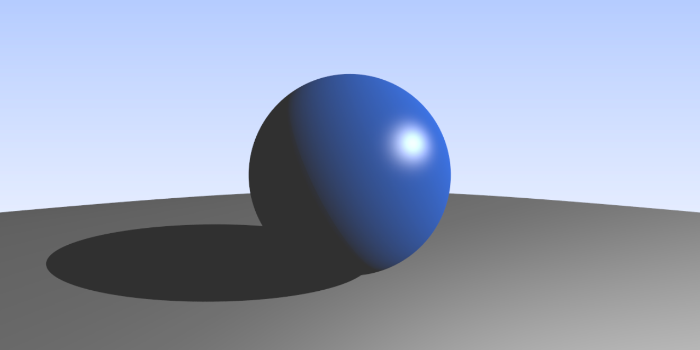

# RAIN

## Description

Rain is an image renderer that uses the [_ray tracing_](https://en.wikipedia.org/wiki/Ray_tracing_(graphics)) technique.

### About

This image renderer is a project of Computer Graphics course of the Federal University of Rio Grande do Norte (UFRN).

The name rain is an acronym for **RA**y trac**IN**g.

## Features and TO DOs

- [ ] Ray Tracer
  - [x] Anti-aliasing
  - [x] Threads
  - [ ] Shaders
    - [x] Background
    - [x] Normal to RGB
    - [x] Depth Map
    - [x] Blinn-Phong
    - [x] Toon (Cel)
    - [ ] Lambertian

- [ ] Scene
  - [x] Scene reader
  - [ ] Scene components
    - [ ] Light
      - [x] Directional Light
      - [x] Point Light
      - [x] Spotlight
      - [ ] Area light
    - [ ] Shapes
      - [x] Sphere
      - [x] Triangle
      - [x] Box
      - [ ] Cylinder
      - [ ] Cone
      - [ ] Materials
        - [x] Blinn-Phong
        - [x] Diffuse
        - [x] Metal
        - [x] Toon
        - [ ] Dielectrics
        - [ ] Texture
  - [ ] Camera
    - [ ] Perspective
    - [ ] Orthogonal

- [x] Printer
  - [x] ASCII
  - [x] Binary
  - [ ] Choose location to save the image file
  - [ ] Supported image file formats
    - [x] PPM
    - [ ] BMP
    - [ ] JPG
    - [ ] PNG
    - [ ] TIFF
    - [ ] GIF
- [x] Miscellaneous
  - [x] Progress Bar
  - [x] Show render time

## Dependencies

- C++17

## How to compile

Use the ```make``` command to compile the renderer.

## How to use

Choose a scene and run the renderer passing the file path of the scene as an argument to render an image.

```bash
# ./render scenefile.txt
./render hello-rain.txt
```

## Scene file format

### Sky

#### Image


> NOTE: The image was converted to png format to be shown here, the renderer does not generate images in that format.

#### Scene Description File

```txt
# Output settings
NAME: sky.ppm
TYPE: PPM
CODIFICATION: binary # or ascii
WIDTH: 1200
HEIGHT: 600
# Ray Tracer Settings
SAMPLES: 1 # Number of samples for anti-aliasing
RAYS:    0 # Number of rays of the recursion
# Camera
CAMERA:
    PERSPECTIVE
    LOOK_FROM: 0 0 0
    LOOK_AT: 0 0 -1
    VUP: 0 1 0
    VFOV: 90
    ASPECT_RATIO: 2
    APERTURE: 0
    FOCAL_DISTANCE: 1
# Scene description
SHADER:
    BACKGROUND
BACKGROUND:
    TOP: 0.5 0.7 1 # Top color
    BOTTOM: 1 1 1  # Bottom color

```

### Blinn-Phong Shader

#### Image


> NOTE: The image was converted to png format to be shown here, the renderer does not generate images in that format.

#### Scene Description File

```txt
# Output settings
NAME: blinn_phong_1.ppm
TYPE: PPM
CODIFICATION: binary # or ascii
WIDTH: 1200
HEIGHT: 600
# Ray Tracer Settings
SAMPLES: 100 # Number of samples for anti-aliasing
RAYS:    0   # Number of rays of the recursion
# Camera
CAMERA:
    PERSPECTIVE
    LOOK_FROM: 0 0 0
    LOOK_AT: 0 0 -1
    VUP: 0 1 0
    VFOV: 90
    ASPECT_RATIO: 2
    APERTURE: 0
    FOCAL_DISTANCE: 1
# Scene description
SHADER:
    BLINNPHONG
    AMBIENT_LIGHT: 0.3 0.3 0.3
BACKGROUND:
    TOP: 0.5 0.7 1 # Top color
    BOTTOM: 1 1 1  # Bottom color
COMPONENTS:
    DIRECTIONAL_LIGHT:
        DIRECTION: 20 10 5
        INTENSITY: 1 1 1
    SPHERE:
        ORIGIN: 0 -100.5 -1
        RADIUS: 100
        BLINN_PHONG_MATERIAL:
            KA: 0.1 0.1 0.1
            KD: 0.3 0.3 0.3
            KS: 1 1 1
            P: 5
    SPHERE:
        ORIGIN: 0 0 -1
        RADIUS: 0.5
        BLINN_PHONG_MATERIAL:
            KA: 0.1 0.1 0.1
            KD: 0 0.3 0.8
            KS: 0.9 0.9 0.9
            P: 64

```

## Author

[](https://github.com/brenov) |
---|
[Breno Viana](https://github.com/brenov) |
