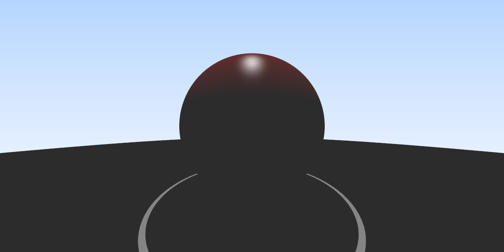
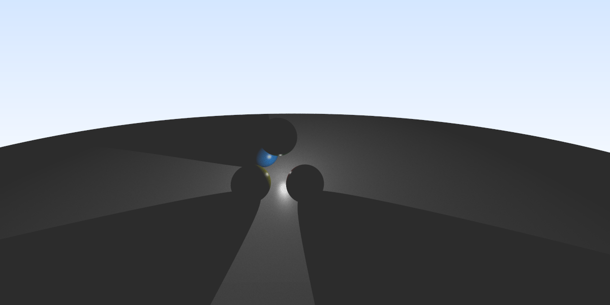
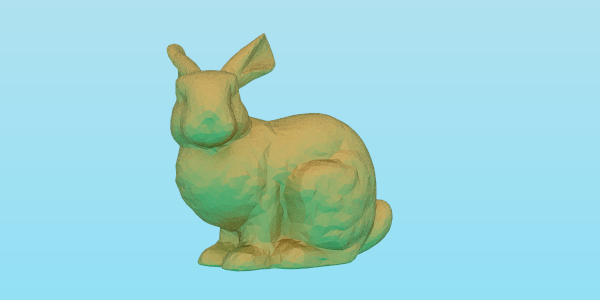

# Images

	

		
		
	

	

		
		
	

	

		
		
	

	

		
		
	

	

		
		
	

	

		
		
	

	

		
		
	

	

		
		
	

	

		
		
	

	

		
		
	

	

		
		
	

	

		
		
	

	

		
		
	

	

		
		
	

	

		
		
	

	

		
	

	

		
		
	

